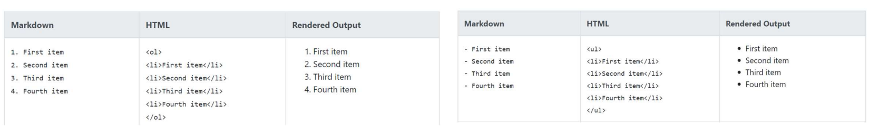
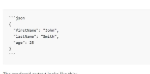
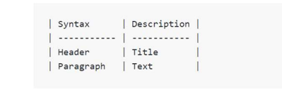

## 깃허브 (GitHub)

> 깃허브는 프로젝트 버전관리. 형상 관리도구
>
> **분산 버전관리 시스템**
>
> 마크다운을 활용한 문서작성


## 마크다운 

> 텍스트 기반의 가벼운 마크업언어 (ex:HTML,웹문서)
>
> Github 에서 사용 가능한 문법 기준으로 정리*


### 마크다운 문법 ###

1. Heading

* Heading은 문서의 제목이나 소제목으로 사용
  * #의 갯수에 따라 대응되는 수준(크기다름)이 있음(**이랑 헷갈리지 말것.w.나영)
  * 주의할점은 무조건 제목에서만 사용해야 함. 글자 크기를 조절하는게 아님.


2. List

* List는 순서가 있는 리스트(ol)와, 순서가 없는 리스트(ul)로 구성




3. Fanced Code block

* 코드블록은 기호 3개를 활용하여 (1옆에있는 따옴표 3개, ```)
* 따옴표 3개를 처음과 끝에 기록하기
* 특정 언어를 명시하면 syntax highliting 가능.
* 이게 뭐냐면, 그 주황색 블록이야..헷갈리지마, 저 안에 문장을 넣는거야.




4. Inline Code block

* 인라인 코드블록이 뭐냐면 회색하이라이트
* 코드블록은 backtick 기호 1개를 인라인에 활용하여 작성(``)


5. Link

* 문자열을 통해 링크 작성 가능. 
* [문자열] (url) 을 통해 링크작성 가능(중간에 스페이스바 지울것*)

**이미지를 통한 링크작성 가능한데<<이거 해봐야함/안해봤음**


6. Blockquotes

인용문은 위에 타이틀을 설명하거나 할때 앞에 회색 띄를 이야기함 <를 통해 인용문 사용가능.

> 이런거


7. Table(표)




8. Text 강조 (굵게,기울임)

* 별표2개(**)는 굵게 아래하이픈(_)은 기울임


9. 수평선

* 3개이상의 asterisks(***), dashes(---) 혹은 undercores(___)


